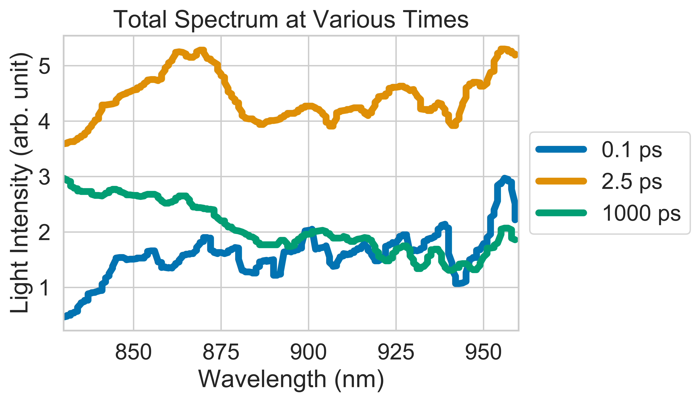
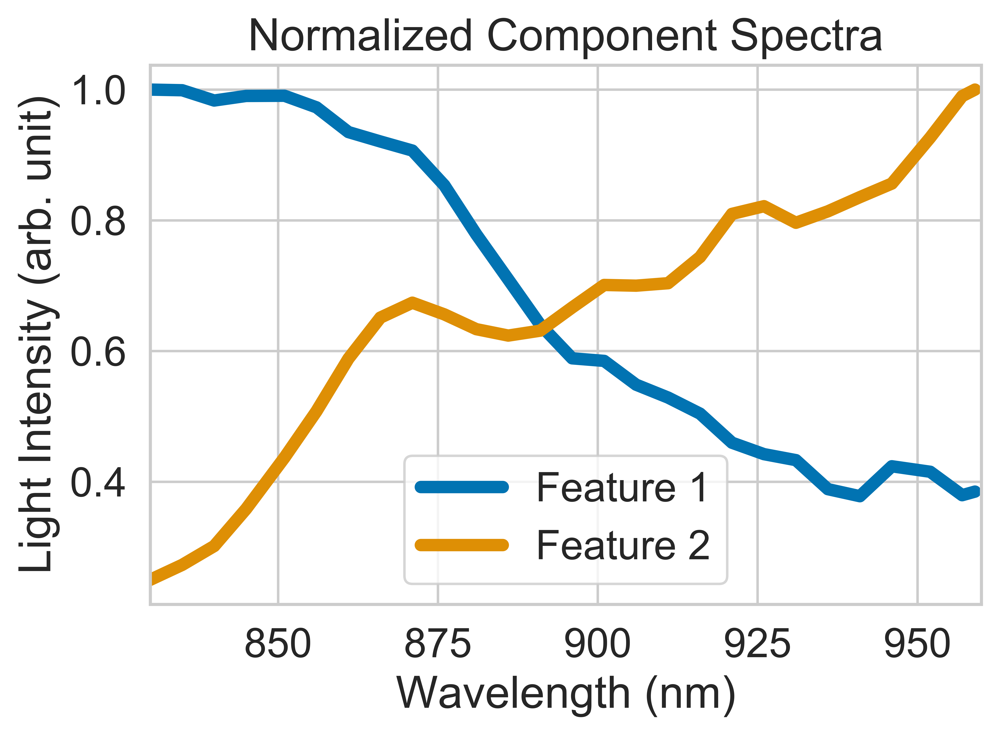
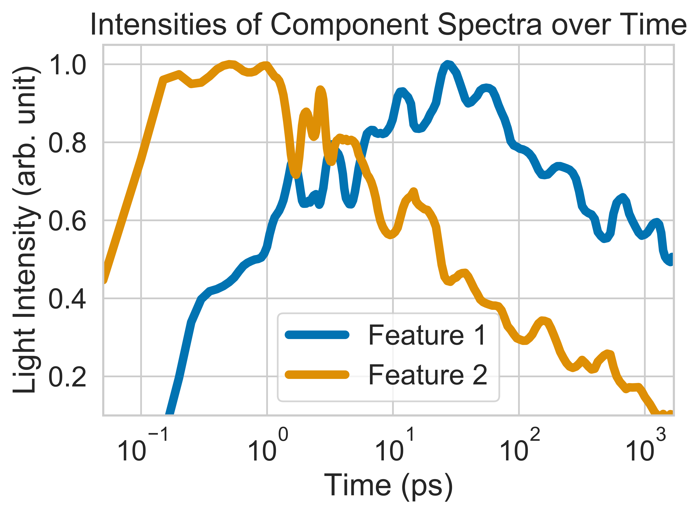

<h1 style="text-align: center;" markdown="1">Machine Learning Genetic Algorithm for    
Spectral Decomposition</h1>

***
Documentation written by Vincent Kim, Optoelectronics Group, University of Cambridge
***
## Installation

This program runs in Python 3.7. It uses libraries such as numpy, scipy, matplotlib, and seaborn.
Data arrays are manipulated and analyzed with numpy and scipy. Visualizations are created with
matplotlib and seaborn. To run the algorithm, the user must have the spectralGA.py and
parameters.py Python modules in the same directory. To start the GA, the user must then run
spectralGA.py, which has the parameters.py module imported. Upon starting, the program will
create a subdirectory that is labeled with a timestamp, and results will be saved as text and
image files. View the GitHub repository [here](https://github.com/kim22914351420/spectralGA).

## Motivation

This module provides an environment to analyze time-series spectral data. It allows the user to
observe an evolving spectrum over time at various wavelengths and intensities. Furthermore, it
uses a genetic algorithm to decompose the evolving spectrum into component spectra that overlap
in time and wavelength. The main motivation of this module is to analyze data from spectroscopy 
experiments. Results from this module inform the fundamental physics of how light interacts with
matter, which have continued to directly impact the design of more efficient solar panels and
light-emitting diodes (LEDs).

## What do genetic algorithms do?

Genetic algorithms (GA) are a type of evolutionary algorithm (EA) that are inspired by the
concept of natural selection in evolutionary biology. They are used in machine learning for
solving optimization problems. When applied to a spectrum whose shape is changing over time, a 
genetic algorithm can tell us the best way to express that spectrum as a sum of smaller spectra
whose intensities grow and decay at different rates. In this sense, the GA analyzes a complex
observation into smaller parts that are easier to understand.  

When analyzing spectral data, those smaller parts are often called "component spectra" or
"spectral features" and they correspond to certain physical processes. In optoelectronic
experiments, they can tell us when and to what extent molecules absorb light, produce electric
charges, and emit light. Knowing how these processes are related allows us to design more
efficient solar panels and LEDs.

## Decomposing a spectrum

This program should be fed 3-dimensional spectral data whose x, y, and z dimensions are
wavelength, time, and intensity, respectively. This data should be contained in a tab-delimited
text file whose first column contains x values, first row contains y values and whose matrix
values contain z values.  

The following is an example of a surface plot of a spectrum:  

We can take slices of this plot at certain times:  

We can see the shape of the spectrum changing in both the surface plot and the plot of time
slices. This can be explained by component spectra that change at different rates. For example,
the GA would decompose the complete spectrum into two spectra as show below:  

These spectra are normalized so that we can compare their shapes. We can graph their actual
intensities over time by plotting their *kinetics*:  

We see that as the intensity of one feature decays, the intensity of the other feature grows.
If the rates of growth and decay are similar, that might mean that the presence of one feature
might lead to the presence of another feature in our model. For instance, the first feature
might be due to a material having absorbed light. The second feature might be caused by electric
charges building up in the material. In this sense, we can see to what extent and how quickly
light is converted into electricity.

## How the GA optimization works

The genetic algorithm optimizes a solution through a process analogous to natural selection.
Populations are created, the fittest are selected to reproduce, mutations arise in the gene pool,
and populations evolve over time. Eventually the process is stops after a certain number of
generations or when the fitness reaches a certain value. The best individual is then chosen,
which compares to the model that best explains the observed data. This best model can then be
used to inform other related models or design processes.  

In this program, each member of the population is a model comprised of a set of normalized spectra
that are guesses for the component spectra. The algorithm clones the first member, but randomly
mutates the shapes of the spectra in each individual. The GA then compares how each of these
similar, guessed models compares to the observed data. The guesses that are most correct are
chosen to be replaced with similar guesses in the next iteration. These new models are made by
randomly interchanging parts of the shapes of the best old models. The new models are then
slightly randomized before repeating the process again. Tying it back to the analogy, the old
models are the parents, the new models are the children, the interchange is called "crossover" and
represents how children are a mix of their parents genes.

## Spectroscopy

While this genetic algorithm module can be used for different types of spectral data or any data of
a similar shape, it was designed with transient absorption spectroscopy (TAS or TA) in mind. This
is a technique used to capture processes that occur on time scales of a billionths of a second or
faster. These experiments are common in the field of optoelectronics. Therefore, names of methods
and variables in this module largely correspond to terms from those experiments. Furthermore,
explanations made up until this point have been simplified. For instance, instead of the intensity
values for the z dimension, TA values are unitless DT/T values that are specific to the TA
experiments. Explanations of TA are readily found elsewhere should someone want a more precise
discussion.

## Classes and Methods

### TAData

Allows the user to interact with spectral data. In practice, these are normally results from
transient absorption spectroscopy (TAS or TA), which is a technique employed extensively in the field
of optoelectronics (how electronic devices interact with light).

### GeneticAlgorithm

Represents a genetic algorithm for optimizing the reconstruction of observed spectral (TA) data.

#### load_initial_guesses_and_reference_spectra

Loads the initial guesses and reference spectra from text files. These spectra are provided by the
user based on theory or previous experiments. Initial guesses are modified during optimization whereas
references are not modified.

#### uncertainty

Uses the standard deviation around each point to estimate the uncertainty of that point locally.

#### smooth

Reduces noise in the TA data before running the genetic algorithm. Smoothing is currently done in
other programs, but this could be expanded to integrate with other spectral analysis modules.

#### cut_off

Sets the region of interest of the TA data for running the genetic algorithm.

#### run_GA

Constructs and runs the genetic algorithm on the TA data.

#### GA_optimization

Generates initial populations, noise, Gaussian functions, and new populations over many generations.

#### evolution

Holds a tournament for the best gene selections.

#### fitness

Calculates how the reconstructed spectra compare to the observed spectra.

#### ss_spline

Creates an interpolation function that is used when switching between the entire axis and the
subsampled axis.

#### QR_solve

A Python implementation of MATLAB's right matrix division ("/"). QR_solve(A, B) performs the
equivalent of MATLAB's A / B that solves for x in the equation Ax = B. In Python, instead of
performing A / B, it computes (B' \ A')' using QR factorization.

#### save_results

Saves the results of the genetic algorithm in text files.

#### save_metadata

Saves parameters for an execution of the genetic algorithm.

#### timeslices

Plots time slices of the complete observed spectrum.

#### surface_plots

Plots surface maps of the total and component spectra.

####

## Credits and Acknowledgements 

This module is based on an excellent genetic algorithm program written in MATLAB by Simon
Gelinas Simon G&eacute;linas during his PhD in the Optoelectronics Group at the University of Cambridge. The
program is discussed in his thesis, and it is a wonderful resource to the group. Many thanks
to Florian Schroeder and Callum Ward for their valuable contributions to said MATLAB program.
